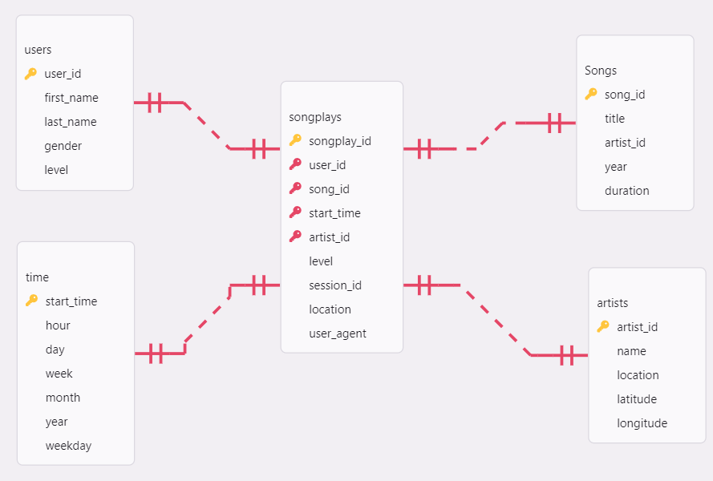

# Data Warehousing with AWS 

## Introduction
In this project a music streaming startup, Sparkify, has grown their user base and song database and want to move their processes and data onto the cloud. Their data resides in S3, in a directory of JSON logs on user activity on the app, as well as a directory with JSON metadata on the songs in their app.

The **aim** of the project is create a `ETL pipeline` that extracts their data from S3, stages them in Redshift, and transforms data into a set of dimensional tables for their analytics team to continue finding insights into what songs their users are listening to.

## Datasets
The datasets used in this project are found in public S3 buckets, where both of the two files are of the format JSON. The song data contains the contains metadata about a song and the artist of that song and the event data contains information on the users, their activities, location and gender etc. 
> song_data.json (song data)
>
>log_data.json (events data)

To access this data, Redshift will be utilised to ingest it using the `COPY`command to read the JSON files within the buckets and copy their content to our **staging tables**.

## Project Template
This project has five files: create.py, etl.py, sql_queries.py, dwh.cfg, and infrastructure_code.ipynb. A fact vs dimension star schema was used to optimize for queries on song play analysis. This includes the following tables:

### Staging Tables
- staging_songs - information of songs and artists
- staging_events - Information on users (their activities, location and gender etc.. )

### Fact Table
- songplays - records in event data associated with song plays i.e. records with page`NextSong`
  (songplay_id,start_time , user_id, level, song_id, artist_id, session_id, location, user_agent)
### Dimension Tables
- users - users in the app
  (user_id, first_name, last_name, gender, level)
- songs - songs in music database
  (song_id, title, artist_id, year, duration)
- artists - artists in music database
  (artist_id, name, location, latitude, longitude)
- time - timestamps of records in songplays broken down into specific units
  (start_time, hour, day, week, month, year, weekday)

<figure>
    <figcaption>Data model</figcaption>
     

## The following where the steps taken to accomplish the project.

### Infrastructure of Data warehouse

1. Create a new `IAM` user in your `AWS` account. 
2. Give it AdministratorAccess and Attach `policies`.
3. Use access key and secret key to create clients for `EC2`, `S3`, `IAM`, and `Redshift`.
4. Create an `IAM` Role that makes `Redshift` able to access `S3 bucket (ReadOnly)`.
5. Create a `RedShift Cluster` and get the `DWH_ENDPOINT(Host address)` and `DWH_ROLE_ARN` and fill the `config` file.

### Set up ETL Pipeline
1. Set up tables to hold data from S3 buckets.
2.  Transferring data from S3 buckets to staging tables in the Redshift cluster.
3. Data was inserted into the fact and dimension tables from the staging tables.

### The Framework of the Project
- `SQL_queries.py` contains variables with SQL statements in String formats, partitioned by `CREATE`, `DROP`, `COPY`, and  `INSERT` statement. 
- `etl.py` executes the queries that ingest JSON data from the S3 bucket. 
- `create_tables.py` will drop old tables (if existing) and re-create new ones.
- `Redshift`, `IAM`, and `S3` configuration information is found in the dhw.cfg file.

Run the Infrastructure code to execute the sql_querie.py, create.py and etl.py.  

##### Sources
- [1]: https://docs.aws.amazon.com/redshift/latest/dg/r_CREATE_TABLE_NEW.html
- [1]: https://docs.aws.amazon.com/redshift/latest/dg/r_COPY.html